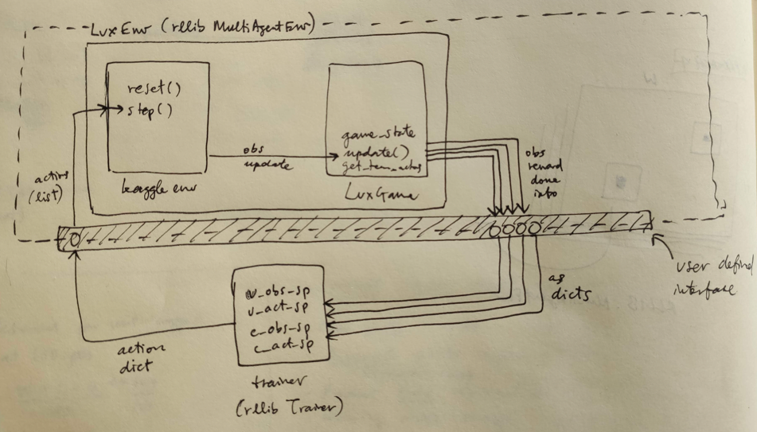

# Lux AI interface to RLlib `MultiAgentsEnv`

For [Lux AI Season 1](https://www.kaggle.com/c/lux-ai-2021) Kaggle competition.

* [LuxAI repo](https://github.com/Lux-AI-Challenge/Lux-Design-2021)
* [RLlib-multiagents docs](https://docs.ray.io/en/stable/rllib-package-ref.html#ray.rllib.env.MultiAgentEnv)  
* [Kaggle environments repo](https://github.com/Kaggle/kaggle-environments#training)

Please let me know if you use this, I'd like to see what people build with it!

## TL;DR

The only thing you need to customise is the interface class (inheriting from 
`multilux.lux_interface.LuxDefaultInterface`). The interface needs to:
* Define observation and action spaces as class attributes
* Implement four "toward-agent" methods:
    - `observation(joint_observation, actors, game_state)`
    - `reward(joint_reward, actors, game_state)`
    - `done(joint_done, actors, game_state)`
    - `info(joint_info, actors, game_state)`
* Implement one "toward-environment" method:    
    - `actions(action_dict)`
* Manage its own `actor id` creation, assignment, etc. 
  (hint citytiles don't have ids in the game engine)

### Implementation diagram



### Example for training

```python
# (1) Define your custom interface for (obs, reward, done, info, actions) ---
from multilux.lux_interface import LuxDefaultInterface
from gym import spaces

class MyInterface(LuxDefaultInterface):
    obs_spaces = {'default': spaces.Box(low=0, high=1,
                                        shape=(2,), dtype=np.float16)}
    act_spaces = {'default': spaces.Discrete(2)}
        
    def observation(self, joint_obs, actors) -> dict:
        # use self.game_state
        return {a: self.obs_spaces['default'].sample() for a in actors}

    def reward(self, joint_reward, actors) -> dict:
        # use self.game_state
        return {a: 0 for a in actors}

    def done(self, joint_done, actors) -> dict:
        # use self.game_state
        d = {a: True for a in actors}
        d['__all__'] = True  # turn completion
        return d

    def info(self, joint_info, actors) -> dict:
        # use self.game_state
        return {a: {} for a in actors}

    def actions(self, action_dict) -> list:
        """
        Takes an RLlib multi-agent style dict.
        Returns a list of LuxAI actions
        """
        # use self.game_state
        return []
    
# (2) Register environment --------------------------------------------------
from ray.tune.registry import register_env
from multilux.lux_env import LuxEnv

def env_creator(env_config):
    
    configuration = env_config.get(configuration, {})
    debug = env_config.get(debug, False)
    interface = env_config.get(interface, MyInterface)
    agents = env_config.get(agents, (None, "simple_agent"))
    
    return LuxEnv(configuration, debug,
                  interface=interface,
                  agents=agents,
                  train=True)

register_env("multilux", env_creator)

# (3) Instantiate agent ------------------------------------------------------
import random
from ray.rllib.agents import ppo

config = {
    "env_config": {},
    "multiagent": {
        "policies": {
            # the first tuple value is None -> uses default policy
            "unit-1": (None, 
                       MyInterface.obs_spaces["unit"], 
                       MyInterface.act_spaces["unit"], 
                       {"gamma": 0.85}),
            "unit-2": (None, 
                       MyInterface.obs_spaces["unit"], 
                       MyInterface.act_spaces["unit"], 
                       {"gamma": 0.99}),
            "citytile": (None, 
                         MyInterface.obs_spaces["citytile"], 
                         MyInterface.act_spaces["citytile"], 
                         {}),
        },
        "policy_mapping_fn":
            lambda agent_id:
                "citytile"  # Citytiles always have the same policy
                if agent_id.startswith("ct_")
                else random.choice(["unit-1", "unit-2"])  # Randomly choose from unit policies
    },
}

trainer = ppo.PPOTrainer(env=LuxEnv, config=config)

# (4) Train away -------------------------------------------------------------
while True:
    print(trainer.train())
```

See [`examples/training.py`](examples/training.py)

---
See also the [LuxPythonEnvGym](https://github.com/glmcdona/LuxPythonEnvGym) `OpenAI-gym` port by @glmcdona.

[Jaime Ruiz Serra](https://www.kaggle.com/ruizserra)
